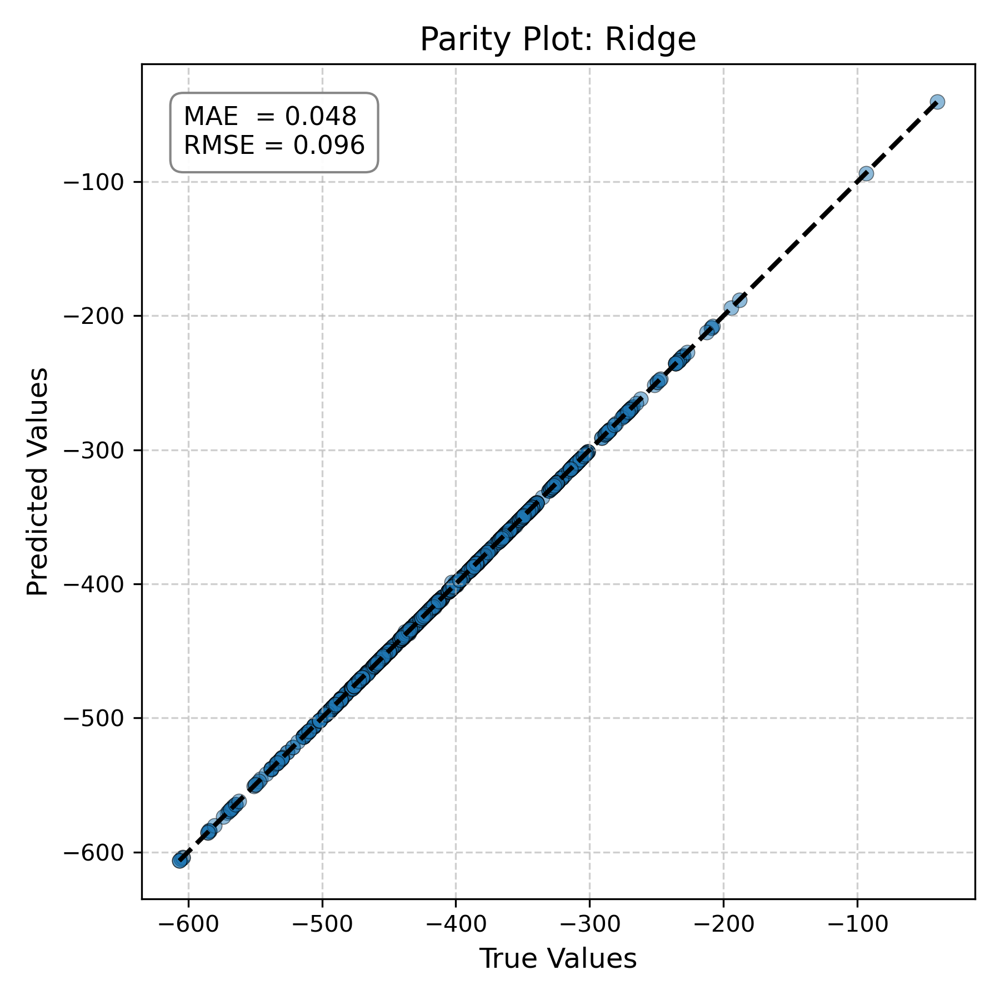
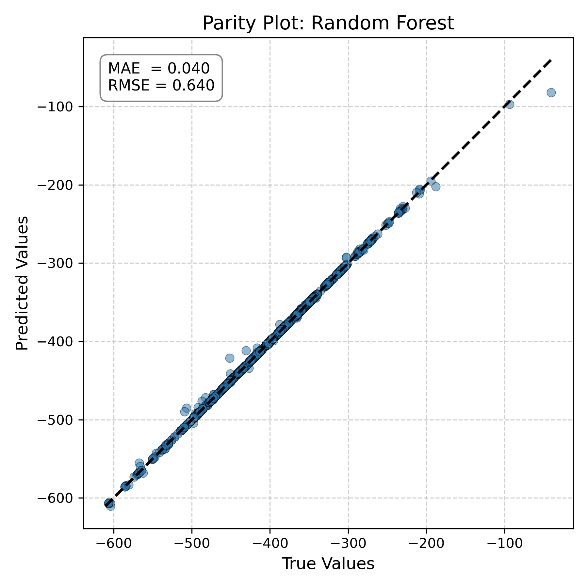
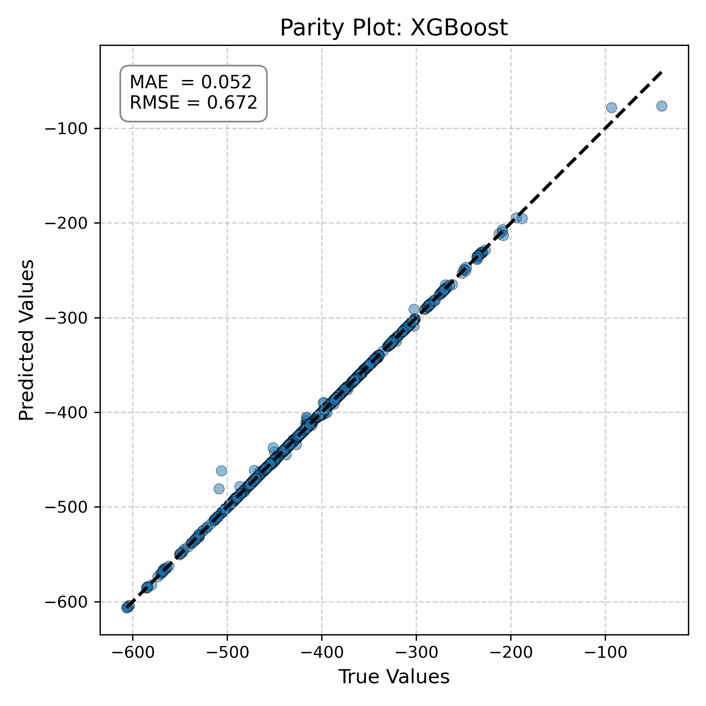

# QM9 Molecular Property Prediction Project

**Objective:** Build a reproducible machine‑learning pipeline that predicts quantum‑chemical
properties of small organic molecules from the QM9 dataset.  Classical descriptors (e.g. RDKit
fingerprints) and graph neural networks are benchmarked side‑by‑side.

 <!-- placeholder for GitHub banner -->

## Quick Start

```bash
# 1. Create environment
conda env create -f environment.yml
conda activate qm9

# 2. Download & preprocess data
python -m src.data.download_qm9 --out data/raw
python -m src.features.featurize --raw data/raw --out data/processed

# 3. Train baseline & GNN models
python -m src.models.train_baselines --config config.yaml
python -m src.models.train_gnn        --config config.yaml

# 4. Evaluate
python -m src.models.evaluate --config config.yaml
```

Results & comparative metrics land in `reports/report.md` and the MLflow tracking
server (`mlruns/`).  Feel free to tweak `config.yaml` to explore other properties.

## Project layout

```text
.
├── src/               # all source code, import‑safe (`python -m ...`)
│   ├── data/          # data download helpers
│   ├── features/      # descriptor builders
│   └── models/        # training & evaluation
├── notebooks/         # exploratory notebooks (optional)
├── reports/           # generated analysis & figures
├── config.yaml        # single‑point configuration
├── environment.yml    # reproducible conda environment
└── .github/workflows/ # CI with pytest + flake8
```

📊 Parity Plots – True vs Predicted Property Values
These plots show how well each model predicts the chosen molecular property (e.g., dipole moment, energy, HOMO–LUMO gap). The closer the points are to the black diagonal, the better the model's predictions.

🔁 Ridge Regression
Predicts linearly from RDKit descriptors + Coulomb matrix. Struggles with non-linear patterns.



🌳 Random Forest
Captures some non-linearity with tree ensembles. Often better than Ridge, but limited without 3D structure.


🚀 XGBoost
Gradient-boosted trees typically outperform Random Forests on tabular data.



## References

* Ramakrishnan *et al.* **Sci. Data** 1, 140022 (2014) – Original QM9 publication.
* MoleculeNet: benchmarks & loaders for QM9.
* PapersWithCode QM9 leaderboard for state‑of‑the‑art metrics.
